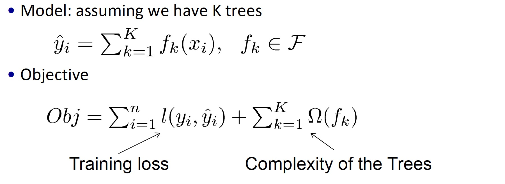

## 目录

- [1 什么是XGBoost](#1)
   - [1.1 XGBoost定义](#1.1)
   - [1.2 ](#1.2)
   - [1.3 ](#1.3)
- [2 ](#2)
- [3 ](#3)
- [4 ](#4)
- [5](#5)
### 1 什么是XGBoost</sapn>
XGBoost是陈天奇等人开发的一个开源机器学习项目，XGBoost是经过优化的分布式梯度提升库，旨在高效、灵活且可移植。
它是基于Gradient Boosting框架实现的机器学习算法。

#### 1.1 XGBoost定义</sapn>

#### 1.2 XGBoost目标函数</sapn>

#### 1.3 </sapn>

### 2 </sapn>

### 3 </sapn>

### 4 </sapn>

### 5 </sapn>